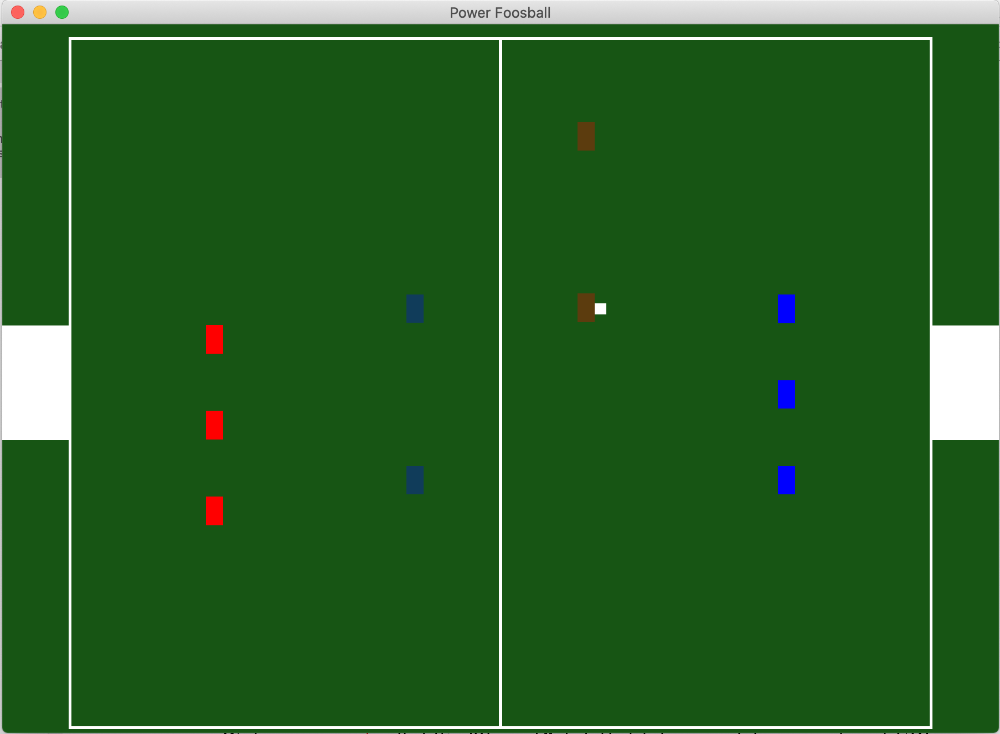

# Power Foosball

Author: Jianrong Yu

Design: This is a multiplayer foosball game that emphasizes on collaboration: passing and catching the ball. One controls the defenders and the other controls the strikers. Single player control will almost certainly lose because the AI is pretty smart.

Screen Shot:



How To Play:

The goal is to score more points then the opponent.

Each team has 3 defenders and 2 strikers. The red players are controlled by your team and your goal is to put the ball in the opposing team's net on the right side.

```
Q: switch defenders to blocking/unblocking (Default: unblockng; Dark red means the player will block when touching the ball; light red means the player won't block when the ball)

E: switch strikers to blocking/unblocking

W: move defenders up

S: move defenders down

Up key: move strikers up

Down key: move strikers down

Shift: when held, your players movements are accelerated. Also, holding shift and direction key at the same time, when the ball is under your control (already stopped), will move the ball vertically.

Space: stops the ball (You can attempt to stop the ball only when you switch to unblock and when the ball passes right thruyou)

Enter: shoot the ball (You can attempt to shoot the ball only when you switch to unblock and when the ball passes right thru you, or is under your control)

1: Switch off/on *smart defense (smart defense is on by default. It automatically switches the defenders between blocking and unblocking so that the defenders don't make mistake by tapping a reflected ball into their own net)

*smart defense doesn't mean auto defense. When it is on, Q is disabled.
```

The ball is initially placed at your defenders. You need to make passes to your strikers so that they have a chance to score whether by stopping the ball and shooting or shoot it at the first touch. If you are ambitious, you can go for goals with your defenders as well. 

This game was built with [NEST](NEST.md).
